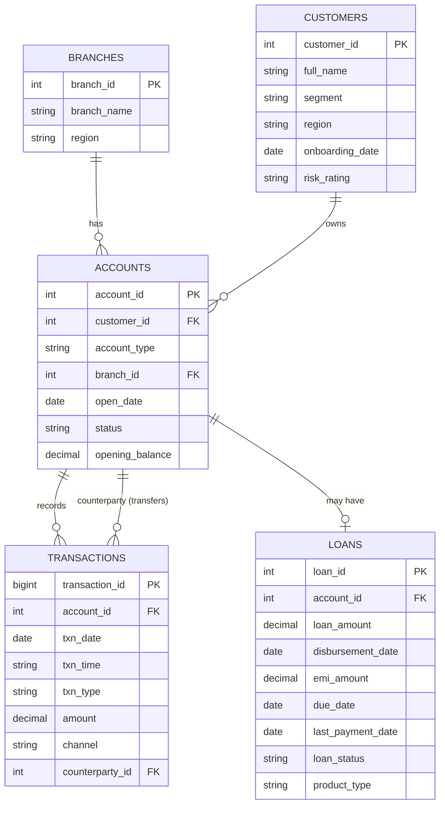

# Database Schema — Entity Relationship Diagram

This diagram shows how the 5 tables in this dataset relate to each other.
GitHub renders this automatically — no image needed.

## Relationship Notes

- **One branch → many accounts.** Each account is opened at exactly one
  branch.
- **One customer → many accounts.** A customer can hold multiple
  accounts (e.g., a Savings account and a Loan account).
- **One account → many transactions.** All deposits, withdrawals, and
  transfers are tied to a single account.
- **One account → at most one loan.** Only accounts with
  `account_type = 'Loan'` have a corresponding row in the loans table.
- **Transactions can reference another account as a counterparty**
  (used for `Transfer` type transactions) — this is a self-referencing
  relationship back into `accounts`.

## Why This Structure

This mirrors a simplified version of a real core banking data model:
customer and account are separated (since one customer can have
multiple accounts), transactions are append-only event records (never
updated, only inserted — which is how real ledgers work), and loans
are modeled as a one-to-one extension of an account rather than a
separate customer-level entity, since a loan is fundamentally an
account-level product.
